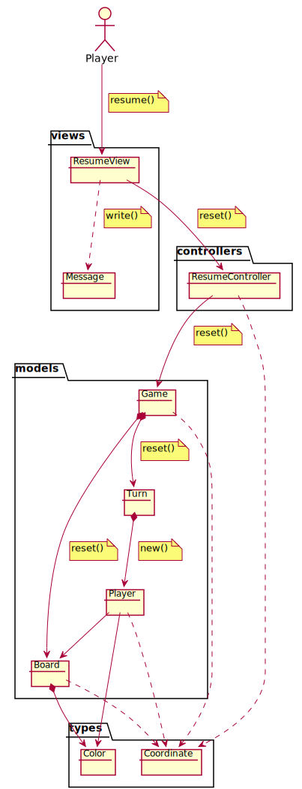
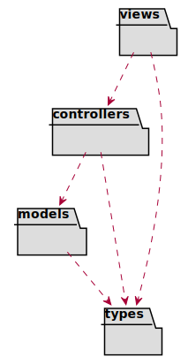

# TicTacToe. Requisitos Gráficos
Universo Santa Tecla  
[uSantaTecla@gmail.com](mailto:uSantaTecla@gmail.com)  
  
**Índice**
 
1. [Analisis](#analisis)  
1.1. [Casos de Uso](#casos-de-uso)  
1.1.1. [Analisis Start](#analisis-start)  
1.1.2. [Analisis Play](#analisis-play)  
1.1.3. [Analisis Resume](#analisis-resume)  
1.2. [Paquetes](#paquetes)  
1.2.1. [Vistas](#vistas)  
1.2.2. [Controladores](#controladores)  
1.2.3. [Modelos](#modelos)  
1.2.4. [Types](#types)  
2. [Diseño](#diseño)  
   2.1. [Vista de Despliegue](#vista-de-despliegue)  
   2.2. [Vista de Participantes](#vista-de-participantes)  
   2.3. [Vista de Interaccion de Participantes](#vista-de-interaccion-de-participantes)  
  

## Analisis  
  

## Casos de Uso  

### Analisis Start  
  

### Analisis Play 
  

### Analisis Resume  
  

## Paquetes  
  

### Vistas  
  

### Controladores  
  

### Modelos  
  

### Types  
  

## Diseño  

### Vista de Despliegue  
  

### Vista de Participantes  
  

### Vista de Interaccion de Participantes  
  
