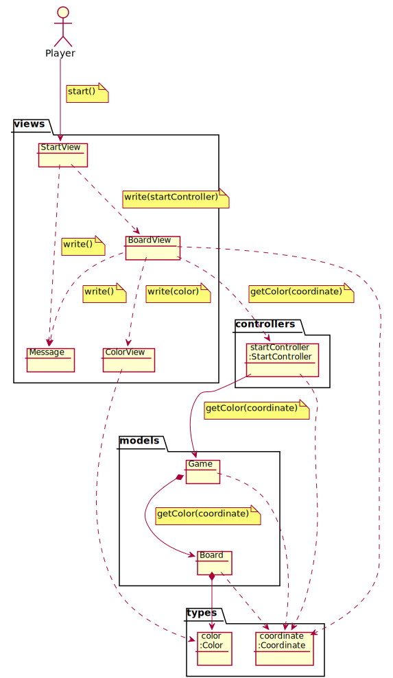
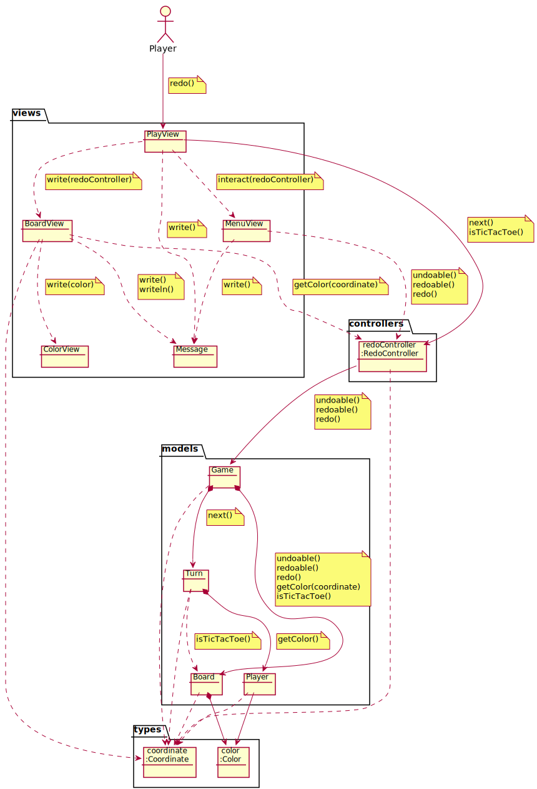
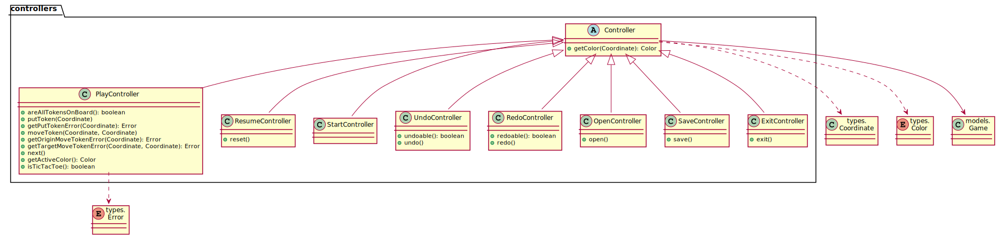

# TicTacToe. Requisitos Ficheros
Universo Santa Tecla  
[uSantaTecla@gmail.com](mailto:uSantaTecla@gmail.com)  
  
**Índice**
 
1. [Analisis](#analisis)  
   1.1. [Casos de Uso](#casos-de-uso)  
      1.1.1. [Analisis Start](#analisis-start)  
      1.1.2. [Analisis Open](#analisis-open)  
      1.1.3. [Analisis Propose](#analisis-propose)  
      1.1.4. [Analisis Undo](#analisis-undo)  
      1.1.5. [Analisis Redo](#analisis-redo)  
      1.1.6. [Analisis Exit](#analisis-exit)  
      1.1.7. [Analisis Save](#analisis-save)  
      1.1.8. [Analisis Resume](#analisis-resume)  
   1.2. [Paquetes](#paquetes)  
      1.2.1. [Vistas](#vistas)  
      1.2.2. [Controladores](#controladores)  
      1.2.3. [Modelos](#modelos)  
      1.2.4. [Types](#types)  
2. [Diseño](#diseño)  
   2.1. [Vista de Despliegue](#vista-de-despliegue)  
   2.2. [Vista de Participantes](#vista-de-participantes)  
   2.3. [Vista de Interaccion de Participantes](#vista-de-interaccion-de-participantes)  
  

## Analisis  
  

## Casos de Uso  

### Analisis Start  
  

### Analisis Open

### Analisis Play 
  

### Analisis Undo 
  

### Analisis Redo 
  

### Analisis Exit

### Analisis Save

### Analisis Resume  
  

## Paquetes  
  

### Vistas  
  

### Controladores  
  

### Modelos  
  

### Types  
  

## Diseño  

### Vista de Despliegue  
  

### Vista de Participantes  
  

### Vista de Interaccion de Participantes  
  