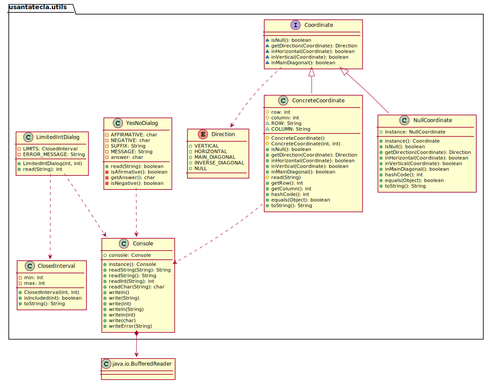

# TicTacToe. Solución 1.1. *domainModel Basic*
Santa Tecla  
[parqueNaturalSantaTecla@gmail.com](mailto:parqueNaturalSantaTecla@gmail.com)  

**Índice**
1. [Requisitos 1. Básica](#requisitos-1-básica)
2. [Vista de Lógica/Diseño](#vista-de-lógicadiseño)  
    2.1. [Arquitectura](#arquitectura)     
    2.2. [Paquete tictactoe](#paquete-tictactoe)  
    2.3. [Paquete utils](#paquete-utils)
3. [Calidad del Software](#calidad-del-software)  
    3.1. [Rediseño](#rediseño)  
4. [Vista de Desarrollo/Implementación](#vista-de-desarrolloimplementación)
5. [Vista de Despliegue/Física](#vista-de-desplieguefísica)
6. [Vista de Procesos](#vista-de-procesos)

# Requisitos 1. *Básica*

| * _Funcionalidad: **Básica**_   * _Interfaz: **Texto**_   * _Distribución: **Standalone**_   * _Persistencia: **No**_  |  | 
| :------- | :------: | 

# Vista de Lógica/Diseño

- Aplicación del *Modelo del Dominio* mediante Estrategias de *Análisis Formal*, *Análisis Clásico*, *Experto del Dominio*, *Reparto de Responsabilidades*, ...

## Arquitectura

## Paquete _tictactoe_

## Paquete _utils_

# Calidad del Software

## Rediseño

  - *Nueva interfaz: Gráfica*
    
      - ***Clases Grandes**: los Modelos asumen la responsabilidad y
        crecen en líneas, métodos, atributos, …​ con cada nueva
        tecnología*
    
      - ***Alto acoplamiento**: los Modelos con cada nueva tecnología de
        interfaz (consola, gráficos, web, …​)*
    
      - ***Baja cohesión**: cada Modelo está gestionando sus atributos y
        las tecnologías de interfaz*
    
      - ***Open/Close**: hay que modificar los modelos que estaban
        funcionando previamente para escoger una tecnología de vista u
        otra (if’s anidados)*

  - *Nuevas funcionalidades: undo/redo, demo, estadísiticas,…​*
    
      - ***Clases Grandes**: los Modelos asumen la responsabilidad y
        crecen en líneas, métodos, atributos, …​ con las nuevas
        funcionalidades*
    
      - ***Open/Close**: hay que modificar los modelos que estaban
        funcionando previamente para incorporar nuevas funcionalidades*

# Vista de Desarrollo/Implementación

# Vista de Despliegue/Física

# Vista de Procesos
- No hay concurrencia
