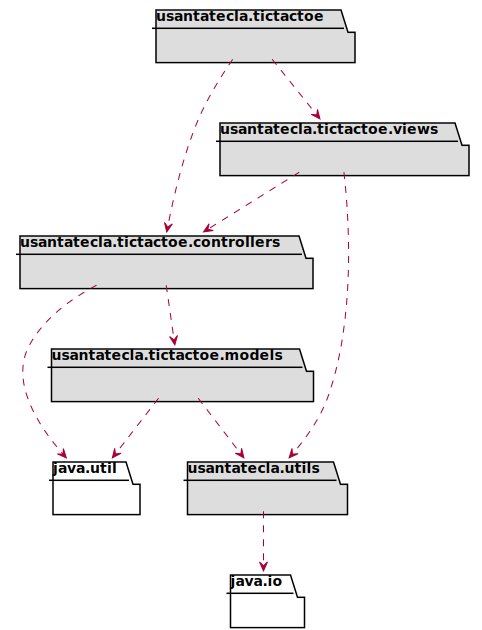
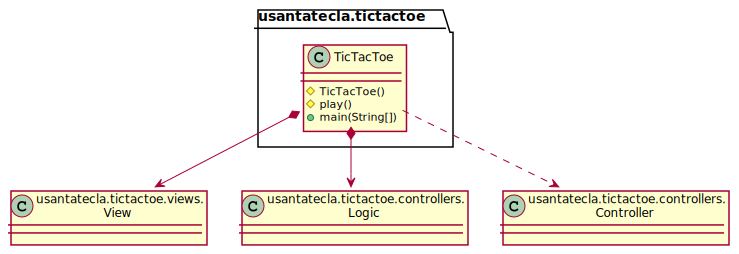
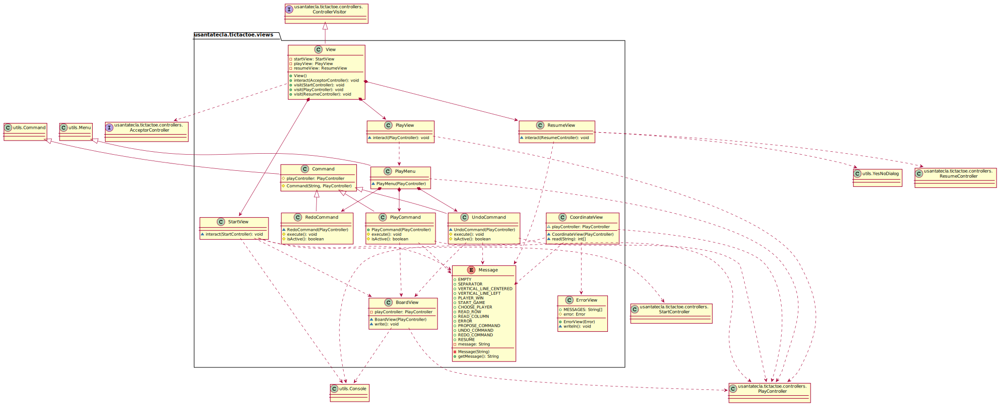
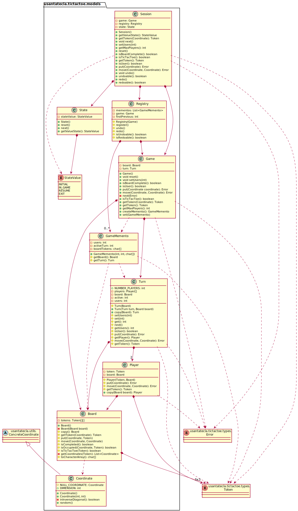
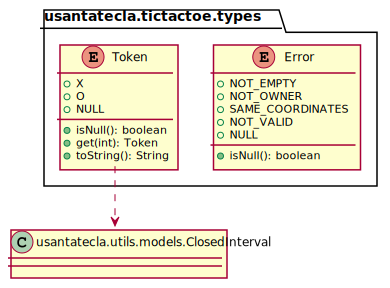
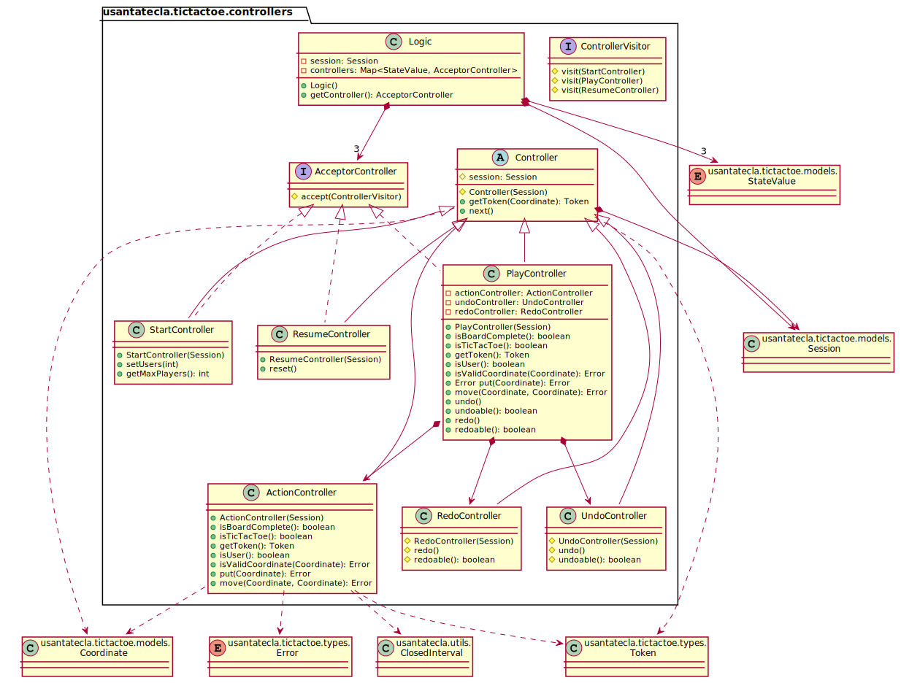

# TicTacToe. Solucion 9.3. mvp - presentationModel - with Composite
Universo Santa Tecla  
[uSantaTecla@gmail.com](mailto:uSantaTecla@gmail.com)

**Índice**
1. [Requisitos 2. Gráficos](#requisitos-2-gráficos)
2. [Vista de Lógica/Diseño](#vista-de-lógicadiseño)  
   2.1. [Arquitectura](#arquitectura)  
   2.2. [Paquete tictactoe](#paquete-tictactoe)  
   2.3. [Paquete tictactoe.views](#paquete-tictactoeviews)  
   2.6. [Paquete tictactoe.types](#paquete-tictactoetypes)  
   2.7. [Paquete tictactoe.models](#paquete-tictactoemodels)  
   2.8. [Paquete tictactoe.controllers](#paquete-tictactoecontrollers)  
   2.9. [Paquete tictactoe.utils](#paquete-tictactoeutils)  
3. [Vista de Desarrollo/Implementación](#vista-de-desarrolloimplementación)
4. [Vista de Despliegue/Física](#vista-de-desplieguefísica)
5. [Vista de Procesos](#vista-de-procesos)

## Requisitos 2. *Gráficos*

| * _Funcionalidad: **Básica + undo/redo**_   * _Interfaz: **Gráfica y Texto**_   * _Distribución: **Standalone**_   * _Persistencia: **No**_  |  |  
| :------- | :------: |

## Vista de Lógica/Diseño
- Modelo/Vista/Presentador con Presentador del Modelo con **Vista Achicada**  
    * **Patrón Command**, para el menú  
    * **Patrón Composite**, para multicontroladores  
    * **Patrón Memento**, para la funcionalidad undo/redo  

### Arquitectura

### Paquete *tictactoe*

### Paquete *tictactoe.views*

### Paquete *tictactoe.models*

### Paquete *tictactoe.types*

### Paquete *tictactoe.controllers*

### Paquete *tictactoe.utils*

## Vista de Desarrollo/Implementación

## Vista de Despliegue/Física

## Vista de Procesos
- No hay concurrencia
