# TicTacToe. Solucion 6.2. mvp - presentationModel - withFacade
Universo Santa Tecla  
[uSantaTecla@gmail.com](mailto:uSantaTecla@gmail.com)  
  
**Índice**
1. [Requisitos 2. Gráficos](#requisitos-2-gráficos)  
2. [Vista de Lógica/Diseño](#vista-de-lógicadiseño)  
2.1. [Arquitectura](#arquitectura)  
2.2. [Paquete tictactoe](#paquete-tictactoe)  
2.3. [Paquete tictactoe.views](#paquete-tictactoeviews)  
2.4. [Paquete tictactoe.views.console](#paquete-tictactoeviewsconsole)  
2.5. [Paquete tictactoe.views.graphics](#paquete-tictactoeviewsgraphics)  
2.6. [Paquete tictactoe.models](#paquete-tictactoemodels)  
2.7. [Paquete tictactoe.types](#paquete-tictactoetypes)  
2.8. [Paquete tictactoe.controllers](#paquete-tictactoecontrollers)  
2.9. [Paquete tictactoe.utils](#paquete-tictactoeutils)  
3. [Calidad del Software](#calidad-del-software)  
3.1. [Diseño](#diseño)  
3.2. [Rediseño](#rediseño)  
4. [Vista de Desarrollo/Implementación](#vista-de-desarrolloimplementación)
5. [Vista de Despliegue/Física](#vista-de-desplieguefísica)
6. [Vista de Procesos](#vista-de-procesos)

## Requisitos 2. *Gráficos*

| * _Funcionalidad: **Básica**_   * _Interfaz: **Gráfica y Texto**_   * _Distribución: **Standalone**_   * _Persistencia: **No**_  |  |  
| :------- | :------: |

## Vista de Lógica/Diseño
  - Arquitectura Documento/Vista mediante **Patrón de Vista Separada**  
    * **Patrón Template Method (Factory Method)**, para clases principales  
    * **Patrón Model View Presenter**, para incluir controllers 
    * **Patrón Facade**, para clases principales  
 
### Arquitectura

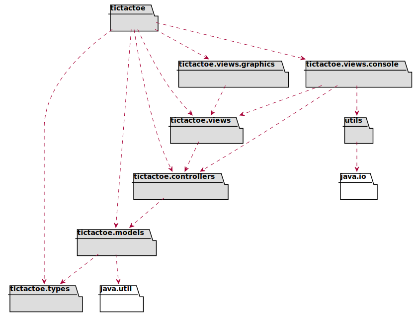

### Paquete *tictactoe*

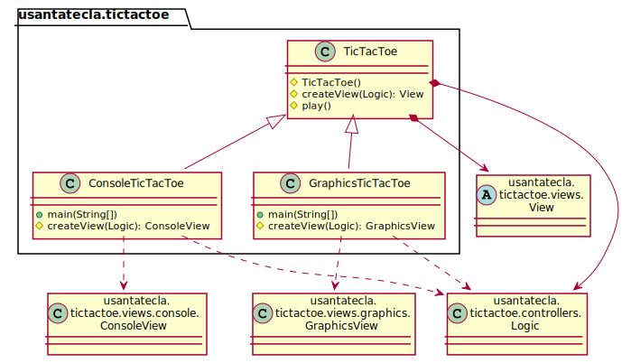

### Paquete *tictactoe.views*

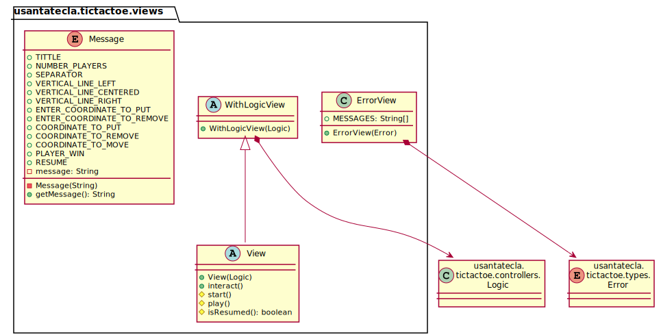

### Paquete *tictactoe.views.console*  

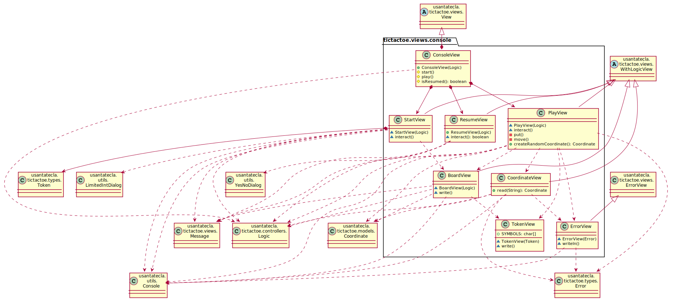

### Paquete *tictactoe.views.graphics*  

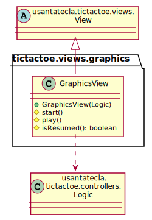

### Paquete *tictactoe.models*

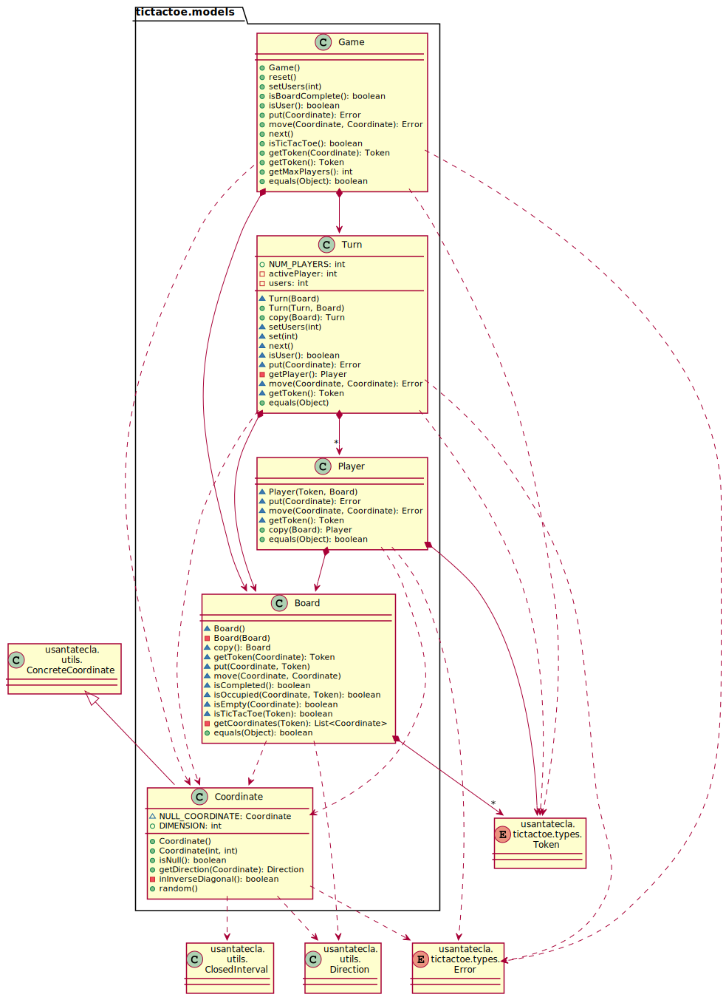

### Paquete *tictactoe.types*

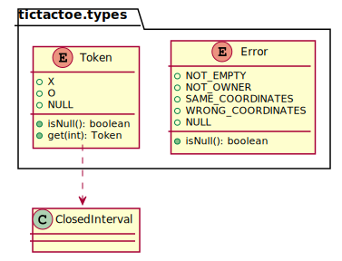

### Paquete *tictactoe.controllers*  

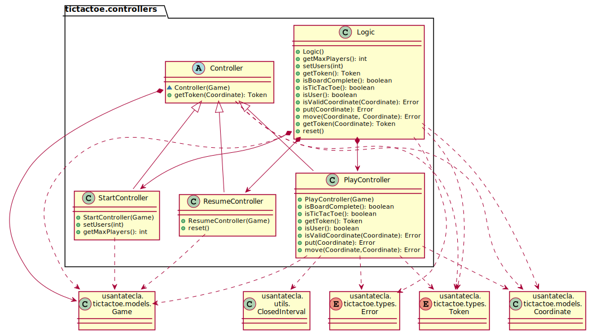

### Paquete *tictactoe.utils*

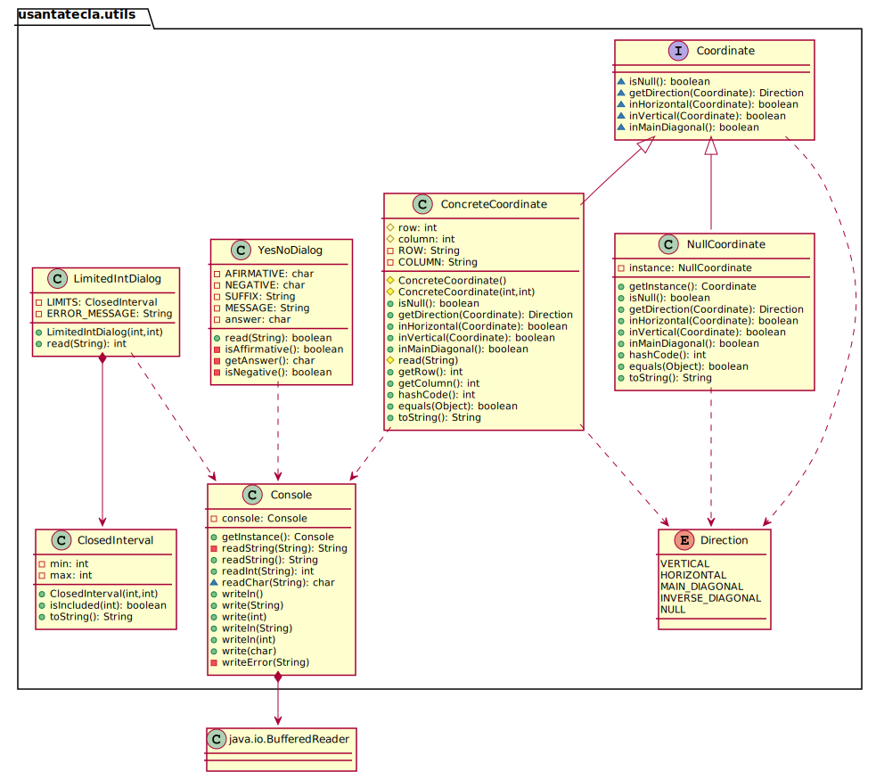

## Calidad del Software

### Diseño

  - ***DRY**: clases principales*

### Rediseño

  - *Nuevas funcionalidades: undo/redo, demo, estadísiticas,…​
    
      - ***Clases Grandes**: los Modelos asumen la responsabilidad y crecen
       en líneas, métodos, atributos, …​ con las nuevas funcionalidades*  
    
      - ***Open/Close**: hay que modificar los modelos que estaban funcionando 
      previamente para incorporar nuevas funcionalidades*

## Vista de Desarrollo/Implementación

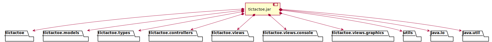

## Vista de Despliegue/Física

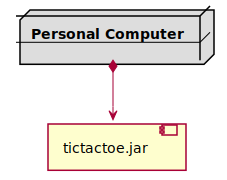

## Vista de Procesos
  - No hay concurrencia
